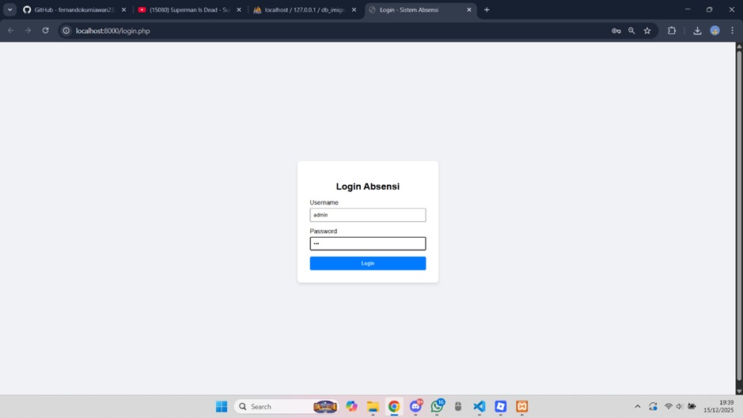
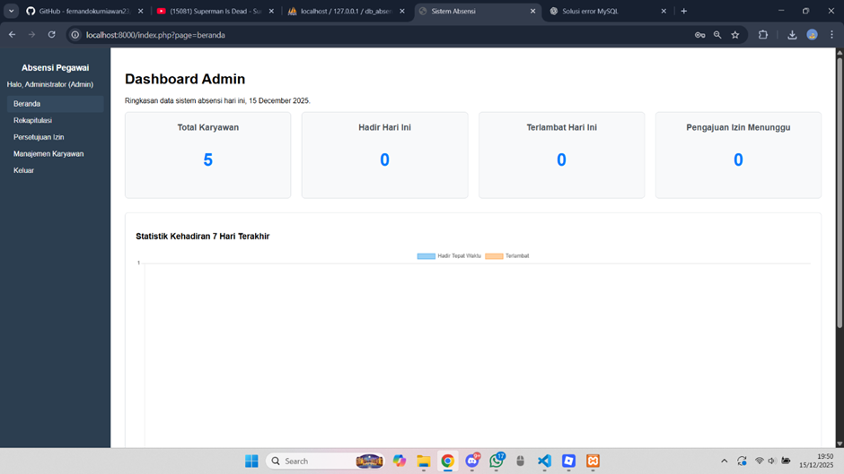
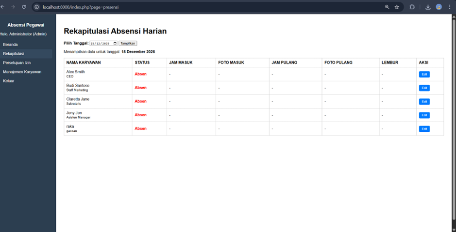
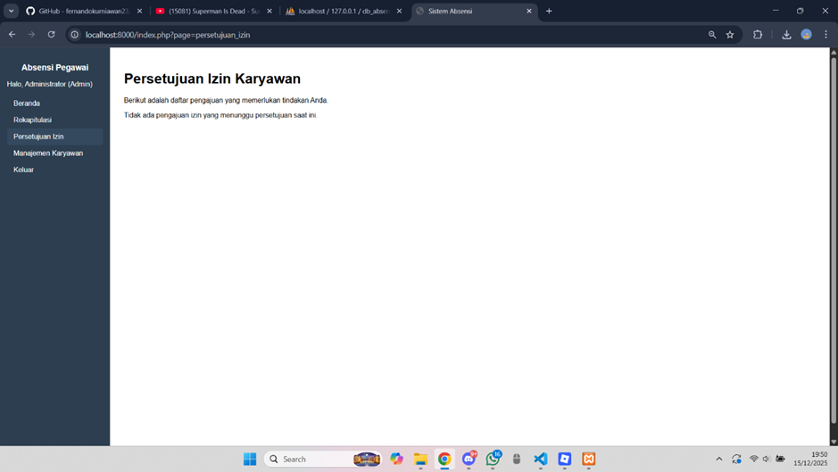
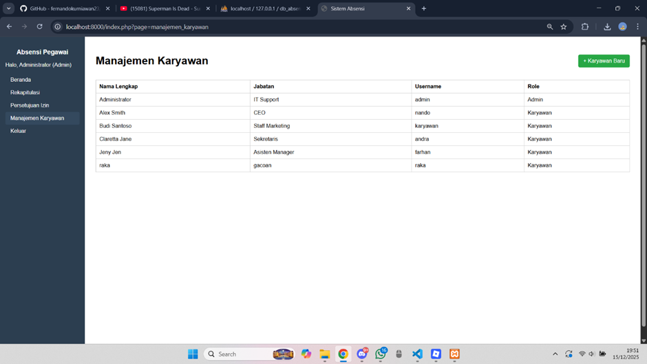
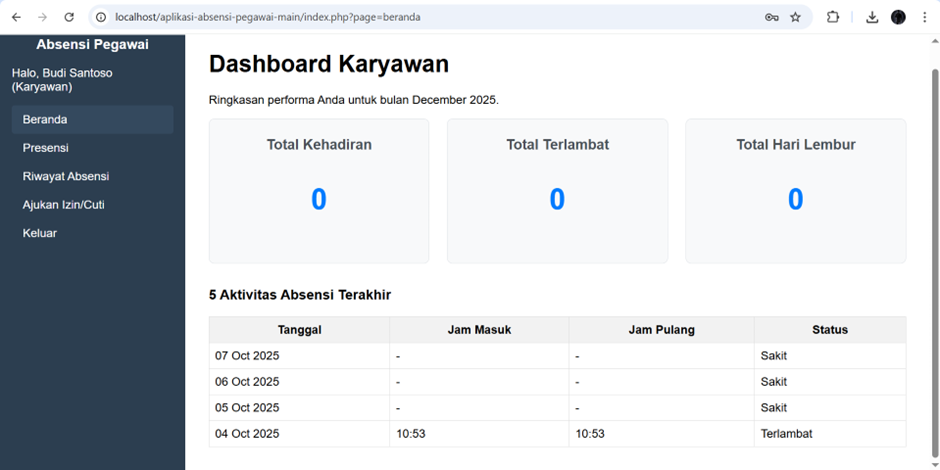
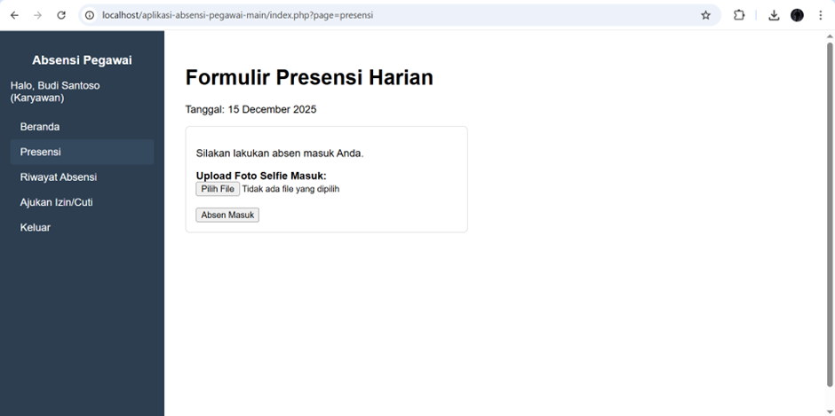
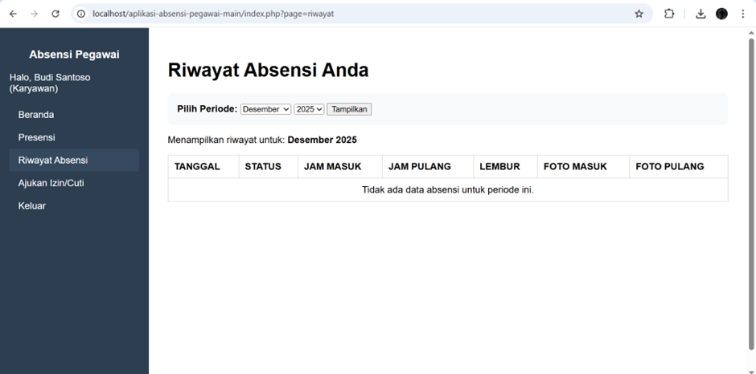
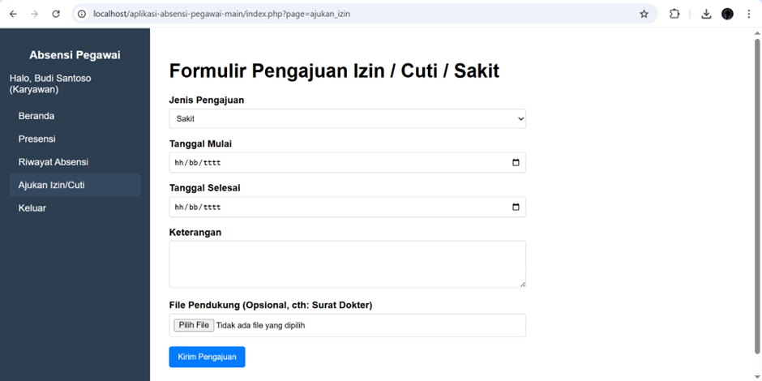

## Akun Demo
ADMIN
- **Username:** admin
- **Password:** 123

Karyawan
- **Username:** karyawan
- **Password:** 456

HALAMAN LOGIN ADMIN DAN KARYAWAN

Halaman login digunakan sebagai pintu masuk ke Sistem Absensi, di mana pengguna memasukkan username dan password untuk melakukan autentikasi sebelum mengakses sistem.

HALAMAN DASBOARD ADMIN

Halaman Dashboard Admin merupakan halaman utama yang ditampilkan setelah administrator berhasil melakukan login ke dalam Sistem Absensi. Halaman ini berfungsi untuk menampilkan ringkasan informasi absensi pegawai secara cepat dan terstruktur pada tanggal berjalan. Di dalam dashboard terdapat beberapa kartu informasi yang menunjukkan total karyawan, jumlah pegawai yang hadir hari ini, jumlah pegawai yang terlambat, serta jumlah pengajuan izin yang masih menunggu persetujuan. Selain itu, dashboard juga dilengkapi dengan statistik kehadiran selama 7 hari terakhir dalam bentuk grafik yang memudahkan administrator memantau pola kehadiran pegawai, baik yang hadir tepat waktu maupun yang terlambat. Pada sisi kiri halaman tersedia menu navigasi yang memungkinkan admin mengakses fitur lain seperti beranda, rekapitulasi absensi, persetujuan izin, manajemen karyawan, dan keluar dari sistem. Halaman ini dirancang untuk membantu administrator dalam melakukan pemantauan dan pengelolaan data absensi secara efisien dan informatif.

HALAMAN REKAPITULASI ABSENSI

Halaman ini menampilkan data kehadiran karyawan berdasarkan tanggal tertentu dalam bentuk tabel, sehingga administrator dapat memantau dan mengelola absensi harian.

HALAMAN PERSETUJUAN IZIN

Halaman ini digunakan oleh administrator untuk meninjau dan memberikan persetujuan terhadap pengajuan izin karyawan yang masuk ke dalam sistem.

HALAMAN MANAJEMEN KARYAWAN

Halaman ini berfungsi untuk mengelola data karyawan, termasuk melihat daftar karyawan dan menambahkan karyawan baru ke dalam sistem.

HALAMAN DASHBOARD KARYAWAN

Dashboard Karyawan adalah halaman utama yang ditampilkan setelah karyawan berhasil login ke Web App Sistem Absensi. Halaman ini berfungsi untuk memberikan gambaran singkat mengenai aktivitas dan kehadiran karyawan.

HALAMAN PRESENSI KARYAWAN

Halaman presensi digunakan oleh karyawan untuk melakukan absen harian dengan mengunggah foto sebagai bukti kehadiran dan menyimpan data absensi ke dalam sistem.

HALAMAN RIWAYAT ABSENSI

Halaman ini menampilkan riwayat kehadiran karyawan berdasarkan periode tertentu, sehingga karyawan dapat memantau data absensi yang telah tercatat.

HALAMAN AJUKAN IZIN/CUTI

Halaman ini digunakan oleh karyawan untuk mengajukan izin, cuti, atau sakit secara online dengan mengisi data dan keterangan yang diperlukan.